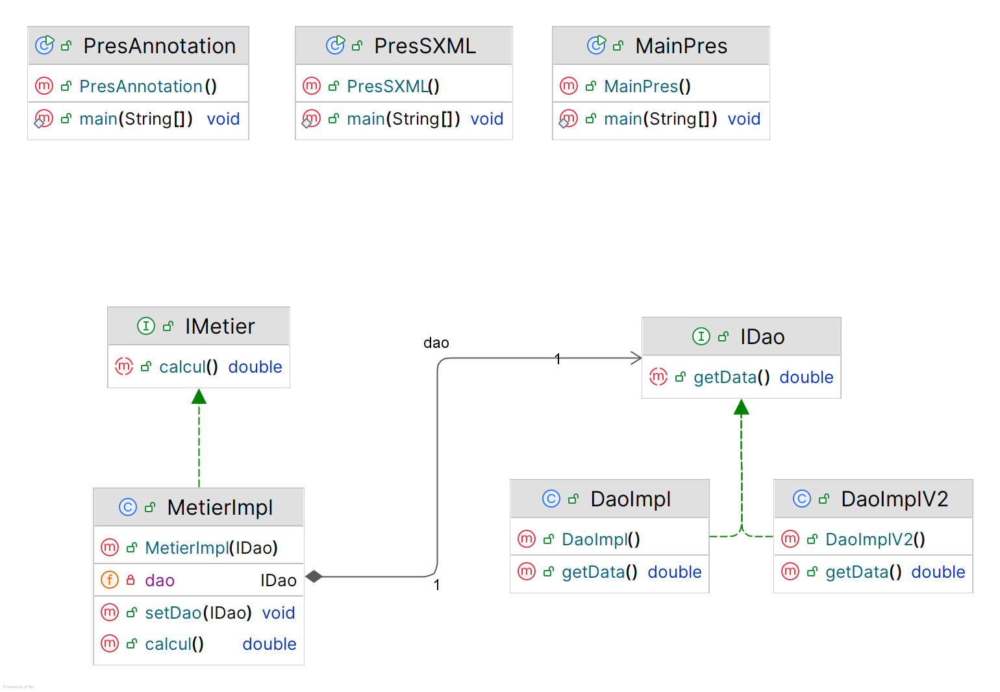

# J2E TP1: Injection des dépendances

## Diagramme de classe:


[//]: # (````mermaid)

[//]: # (classDiagram)

[//]: # (direction BT)

[//]: # (class DaoImpl {)

[//]: # (  + DaoImpl&#40;&#41; )

[//]: # (  + getData&#40;&#41; double)

[//]: # (})

[//]: # (class DaoImplV2 {)

[//]: # (  + DaoImplV2&#40;&#41; )

[//]: # (  + getData&#40;&#41; double)

[//]: # (})

[//]: # (class IDao {)

[//]: # (<<Interface>>)

[//]: # (  + getData&#40;&#41; double)

[//]: # (})

[//]: # (class IMetier {)

[//]: # (<<Interface>>)

[//]: # (  + calcul&#40;&#41; double)

[//]: # (})

[//]: # (class MainPres {)

[//]: # (  + MainPres&#40;&#41; )

[//]: # (  + main&#40;String[]&#41; void)

[//]: # (})

[//]: # (class MetierImpl {)

[//]: # (  + MetierImpl&#40;IDao&#41; )

[//]: # (  - IDao dao)

[//]: # (  + calcul&#40;&#41; double)

[//]: # (  + setDao&#40;IDao&#41; void)

[//]: # (})

[//]: # (class PresAnnotation {)

[//]: # (  + PresAnnotation&#40;&#41; )

[//]: # (  + main&#40;String[]&#41; void)

[//]: # (})

[//]: # (class PresSXML {)

[//]: # (  + PresSXML&#40;&#41; )

[//]: # (  + main&#40;String[]&#41; void)

[//]: # (})

[//]: # ()
[//]: # (DaoImpl  ..>  IDao )

[//]: # (DaoImplV2  ..>  IDao )

[//]: # (MainPres  ..>  DaoImplV2 : «create»)

[//]: # (MainPres  ..>  MetierImpl : «create»)

[//]: # (MetierImpl "1" *--> "dao 1" IDao )

[//]: # (MetierImpl  ..>  IMetier )

[//]: # ()
[//]: # (````)